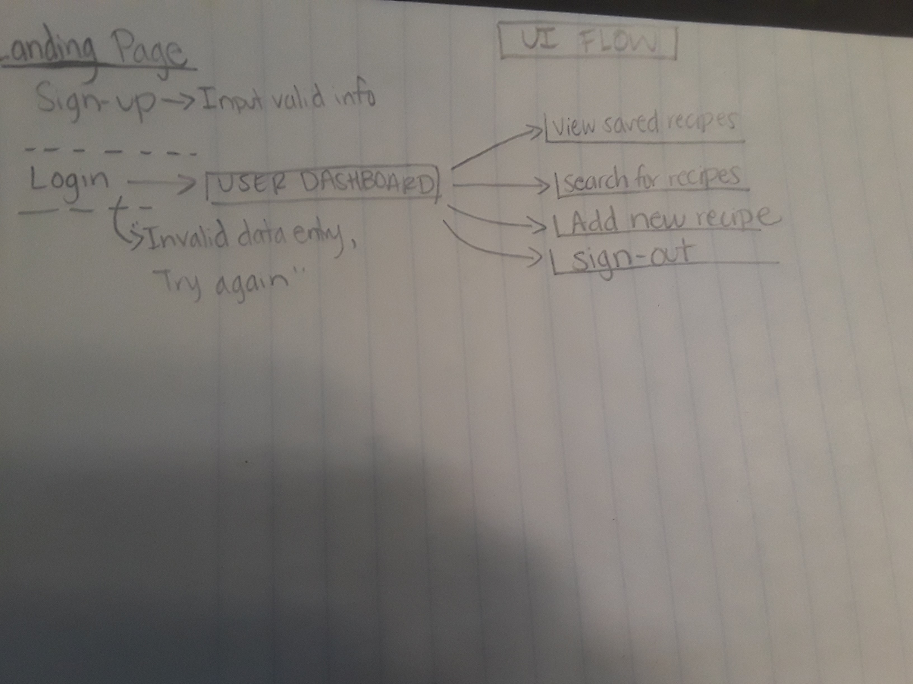

# recipe-book-fullstack-capstone
Node live pre-view available at https://recipe-book-capstone.herokuapp.com/
React live pre-view available at https://blancahc.github.io/recipe-book-fullstack-capstone-react/build

# Goal & Use Case

This is a simple app where someone can search for, create his/her own recipes and save them like in a recipe book.

# Screenshots

# User Stories & Initial UX

**Landing Page**

1. As a visitor, I want to land on the main page and understand what this website is about in order for me to use it. As a registered user, I should be able to easily sign in.

2. As a visitor, I want to be able to easily sign-up to be able to use the application. In any page, I should be able to sign out.

3. As a user, I want to easily add my recipes.

4. As a user, I want to get a detailed view of my saved receipes and search through them by title or tag.

# Technical stack

**Front-end**
 * HTML5
 * CSS3
 * JavaScript
 * jQuery
 * React

**Back-end**
 * NodeJS
 * Mongoose / MongoDB
 * Heroku (hosting)

**Testing**
 * Mocha & Chai
 * TravisCI

**Responsiveness**
 * The site is fully responsive on most mobile & laptop devices.
 * Tested on Chrome, Firefox & Safari.

**Security**
 * Passport
 * Bcrypt

### Version 1.1
 * Ability for users to share recipes with others through email
 * Ability to search for recipes using external API for users to save recipes directly

#  The typical command lines for capstone projects

## Node command lines
* npm install ==> install all node modules
    * npm install --save bcrypt bcryptjs body-parser cors express mongodb mongoose passport passport-http unirest
    * npm install --save-dev chai chai-http mocha faker
* nodemon server.js ==> run node server
* npm test ==> run the tests

## React command lines
* npm install ==> install all node modules
    * npm install --save bcrypt bcryptjs body-parser cheerio chokidar-cli concurrently core-js cors cpr enzyme enzyme-react-16-adapter-setup express http-server jsonwebtoken moment mongodb mongoose morgan npm-run-all passport passport-http passport-jwt passport-jwt-strategy react react-addons-test-utils react-dom react-fontawesome react-redux redux redux-thunk rimraf unirest
    * npm install --save-dev acorn babel-cli babel-core babel-loader babel-plugin-transform-object-rest-spread babel-polyfill babel-preset-es2015 babel-preset-react chai chai-enzyme chai-http enzyme-adapter-react-15 enzyme-adapter-react-16 faker json-loader mkdirp mocha react-scripts react-test-renderer sinon sinon-chai webpack
* npm run build ==> build the react files in the "build" folder
* npm start ==> run react server on http://127.0.0.1:8080
* npm test ==> run the tests
